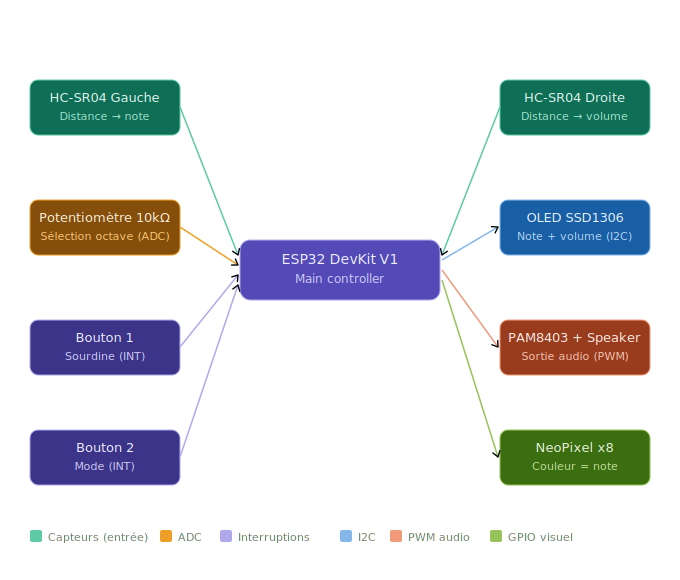
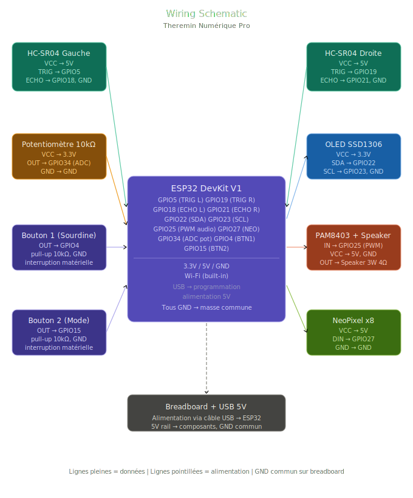

# Theremin Digital Pro

| | |
|-|-|
|`Author` | Catana Mihai-Laurentiu

## Description
Theremin Numérique Pro est un instrument de musique numérique sans contact physique. L'utilisateur contrôle la hauteur et le volume du son en déplaçant ses mains au-dessus de deux capteurs à ultrasons, sans aucun contact physique. La main gauche contrôle la note musicale (Do, Ré, Mi...), tandis que la main droite contrôle le volume. Un potentiomètre permet de changer d'octave, et deux boutons offrent les fonctions de sourdine et de changement de mode. La note actuelle et le volume sont affichés en temps réel sur un écran OLED, et des LEDs RGB fournissent un retour visuel synchronisé avec le son.

## Motivation
J'ai toujours été fasciné par la musique et l'électronique. Ce projet me permet de combiner ces deux passions en créant un instrument que l'on joue sans le toucher — une idée qui me semblait presque magique avant de comprendre comment la réaliser. 
## Architecture
```
[HC-SR04 Gauche] ──← note musicale
      │
      ▼
[ESP32 DevKit V1]
      │
      ├──← [HC-SR04 Droite]
      │         volume
      │
      ├──← [Potentiomètre 10kΩ]
      │         sélection octave (ADC)
      │
      ├──← [Bouton 1]
      │         sourdine (interruption matérielle)
      │
      ├──← [Bouton 2]
      │         changement de mode (interruption matérielle)
      │
      ├──→ [OLED SSD1306]
      │         note actuelle + barre de volume (I2C)
      │
      ├──→ [PAM8403 + Haut-parleur 3W]
      │         sortie audio (PWM)
      │
      └──→ [NeoPixel x8]
                couleur synchronisée avec la note
```
Le système est composé de plusieurs modules :

Module de contrôle : ESP32 DevKit V1
Module de détection pitch : HC-SR04 Gauche (distance main → note musicale)
Module de détection volume : HC-SR04 Droite (distance main → volume)
Module de sélection : potentiomètre 10kΩ (sélection de l'octave via ADC)
Module d'affichage : écran OLED SSD1306 (note actuelle + barre de volume via I2C)
Module audio : amplificateur PAM8403 + haut-parleur 3W (sortie audio via PWM)
Module visuel : bande NeoPixel x8 (couleur synchronisée avec la note)
Module interaction : 2 boutons poussoirs (sourdine + changement de mode via interruptions matérielles)

Le processus de fonctionnement est le suivant :

Lecture de la distance de la main gauche via HC-SR04 Gauche.
Conversion de la distance en fréquence musicale (Do, Ré, Mi...).
Lecture de la distance de la main droite via HC-SR04 Droite.
Conversion de la distance en niveau de volume.
Lecture du potentiomètre via ADC pour déterminer l'octave active.
Génération du signal audio via PWM vers le module PAM8403.
Mise à jour en temps réel de l'écran OLED :

note musicale actuelle,
barre de volume.


Mise à jour de la couleur des LEDs NeoPixel selon la note jouée.

Le système propose deux modes de jeu :

Free Play — fréquence continue et variable selon la distance exacte,
Quantized — le son se verrouille sur la note musicale la plus proche (Do, Ré, Mi, Fa, Sol, La, Si).

Les boutons déclenchent des interruptions matérielles pour une réponse instantanée, sans délai lié à la boucle principale du programme.
### Block diagram

<!-- Make sure the path to the picture is correct -->


### Schematic



### Components


<!-- This is just an example, fill in with your actual components -->

### Components

| Device | Usage | Price |
|--------|--------|-------|
| ESP32 DevKit V1 | Microcontrôleur principal | ~35 RON |
| Capteur à ultrasons HC-SR04 (x2) | Contrôle note (main gauche) + volume (main droite) | ~20 RON |
| Écran OLED SSD1306 0.96" I2C | Affiche note actuelle + barre de volume | ~20 RON |
| Module Amplificateur PAM8403 | Amplification audio | ~10 RON |
| Haut-parleur 3W 4Ω | Sortie audio | ~10 RON |
| Bande LED RGB NeoPixel (8 LEDs) | Retour visuel - couleur change selon la note | ~15 RON |
| Potentiomètre 10kΩ | Sélection de l'octave via ADC | ~3 RON |
| Bouton poussoir (x2) | Sourdine + changement de mode avec interruptions | ~2 RON |
| Résistances 10kΩ (x2) | Pull-up boutons | ~1 RON |
| Résistances 220Ω | Protection LED | ~1 RON |
| Breadboard 830 points | Prototypage | ~10 RON |
| Fils de connexion | Connexion des composants | ~7 RON |
| Câble USB | Alimentation + programmation ESP32 | ~5 RON |

**Total: ~139 RON**

### Libraries

<!-- This is just an example, fill in the table with your actual components -->
| Library | Description | Usage |
|---------|-------------|-------|
| [Adafruit SSD1306](https://github.com/adafruit/Adafruit_SSD1306) | Pilote pour écrans OLED SSD1306 | Affichage note + volume via I2C |
| [Adafruit GFX](https://github.com/adafruit/Adafruit-GFX-Library) | Bibliothèque graphique | Rendu texte et graphiques sur OLED |
| [Adafruit NeoPixel](https://github.com/adafruit/Adafruit_NeoPixel) | Pilote pour LEDs RGB WS2812 | Contrôle couleur NeoPixel selon la note |
| [Wire](https://www.arduino.cc/reference/en/language/functions/communication/wire/) | Communication I2C | Connexion OLED SSD1306 |
| [ESP32 Arduino Core](https://github.com/espressif/arduino-esp32) | Support ESP32 pour Arduino IDE | PWM audio, ADC, interruptions, GPIO |
| [Arduino](https://www.arduino.cc/) | Bibliothèque de base Arduino | Fonctions de base tone(), analogRead() |
## Log

<!-- write every week your progress here -->

### Week 6 - 12 May

### Week 7 - 19 May

### Week 20 - 26 May


## Reference links

<!-- Fill in with appropriate links and link titles -->

